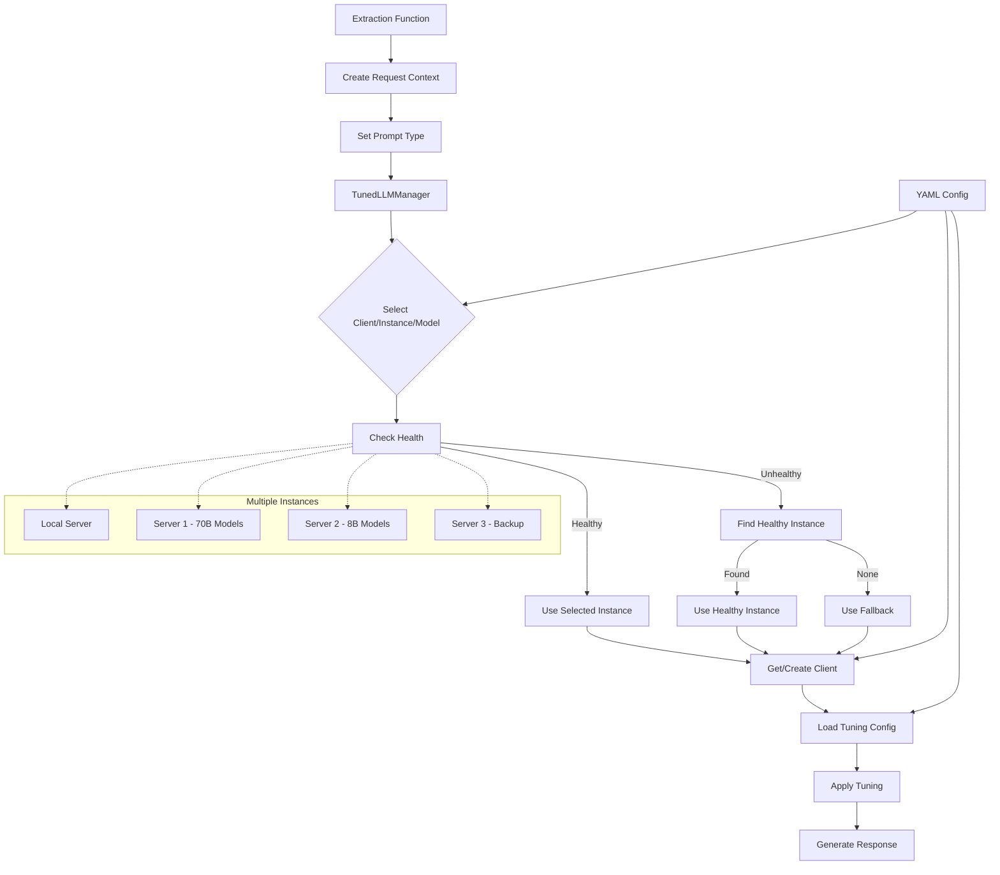

# Multi-Model LLM Architecture

## Overview

The Multi-Model LLM Architecture provides a flexible, configurable system for working with multiple LLM clients, models, and instances. This architecture enables:

1. **Context-Aware Tuning**: Automatically adjust parameters based on the prompt type
2. **Multi-Client Support**: Seamlessly work with different LLM providers (Ollama, OpenAI, etc.)
3. **Multi-Instance Support**: Distribute requests across multiple servers
4. **Multi-Model Selection**: Use different models for different tasks
5. **Auto-Discovery**: Automatically discover and register new client implementations
6. **Configuration-Driven**: Control behavior through YAML configuration files
7. **Health Monitoring**: Automatically detect and avoid unhealthy servers
8. **Fallback Mechanisms**: Gracefully handle failures by falling back to alternative clients/models

## Architecture Diagram

## Key Components

### 1. TunedLLMManager

The central component that manages client selection, health checking, and parameter tuning. It:
- Selects the appropriate client, instance, and model based on the prompt type
- Checks the health of instances and falls back to alternatives if needed
- Loads and applies tuning parameters based on the context
- Creates and manages client instances

### 2. Client Registry

Automatically discovers and registers LLM client implementations:
- Scans the `llm_client` directory for files ending with `_client.py`
- Registers all classes that inherit from `LLMClient`
- Provides a registry of available client types

### 3. Configuration System

A hierarchical YAML-based configuration system that defines:
- Client connection parameters (base URLs, API keys)
- Client-specific settings (health endpoints, timeouts)
- Model selection rules for different prompt types
- Tuning parameters for different prompt types, clients, and models

### 4. Request Context

Captures information about the request context:
- Prompt type (node extraction, edge extraction, etc.)
- Source module and function
- Content information (length, type)
- Additional metadata

## Request Flow

1. An extraction function creates a request context with the prompt type
2. The context is passed to the TunedLLMManager
3. The manager selects the appropriate client, instance, and model based on the prompt type
4. The manager checks the health of the selected instance
5. If the instance is healthy, it's used; otherwise, a healthy alternative is found
6. The manager loads tuning parameters based on the prompt type, client, and model
7. The parameters are applied to the request
8. The request is sent to the LLM
9. The response is returned to the extraction function

## Benefits

- **Resource Optimization**: Use smaller models for simpler tasks, larger models for complex ones
- **High Availability**: Automatically detect and avoid unhealthy servers
- **Flexibility**: Easily switch between different clients and models
- **Maintainability**: Configuration-driven approach reduces code changes
- **Extensibility**: Easily add new client types without modifying core code
- **Distributed Processing**: Spread load across multiple servers
