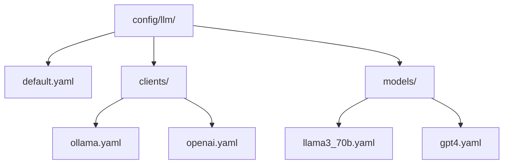
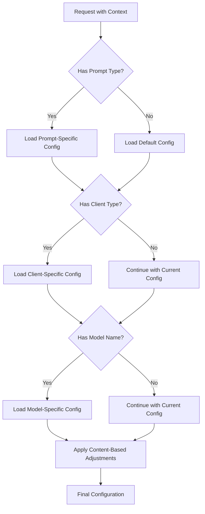

# Configuration System

The Multi-Model LLM Architecture uses a hierarchical YAML-based configuration system that provides a clean, maintainable way to configure all aspects of the system. The system supports multiple configuration directories, allowing you to switch between different configurations based on environment, database, or even group ID.

## Multiple Configuration Directories

The configuration system supports multiple configuration directories, with the active directory specified via environment variables or a `.env` file:

```
LLM_CONFIG_ROOT=/path/to/config/directory
LLM_CONFIG_PROFILE=production  # Optional profile name
```

This allows you to maintain separate configurations for different environments (development, staging, production) or different use cases (different databases, different group IDs).

### Configuration Profiles

You can organize configurations into profiles:

```
configs/
├── default/
│   ├── llm/
│   │   ├── default.yaml
│   │   ├── clients/
│   │   └── models/
├── production/
│   ├── llm/
│   │   ├── default.yaml
│   │   ├── clients/
│   │   └── models/
├── development/
│   ├── llm/
│   │   ├── default.yaml
│   │   ├── clients/
│   │   └── models/
└── groups/
    ├── group_123/
    │   ├── llm/
    │   │   ├── default.yaml
    │   │   ├── clients/
    │   │   └── models/
    └── group_456/
        ├── llm/
        │   ├── default.yaml
        │   ├── clients/
        │   └── models/
```

### Configuration Resolution

Configurations are resolved in the following order of precedence:

1. Group-specific configuration (if a group ID is provided)
2. Profile-specific configuration (if a profile is specified)
3. Default configuration

This allows you to override specific settings for different environments or groups while inheriting the rest from the default configuration.

## Configuration Structure



## Configuration Files

### default.yaml

The main configuration file that defines global settings, client connections, and model selection rules:

```yaml
# Global connection settings
connections:
  # Define client types and their settings
  OllamaClient:
    # Client-specific settings
    settings:
      health_endpoint: "/api/health"
      timeout: 5.0

    # Multiple instances
    instances:
      local:
        base_url: "http://localhost:11434"
        api_key: ""
        description: "Local Ollama server"

      server1:
        base_url: "http://192.168.1.101:11434"
        api_key: ""
        description: "High-performance server with 70B models"

  OpenAIClient:
    # Client-specific settings
    settings:
      health_endpoint: null  # No health endpoint for OpenAI
      timeout: 10.0

    base_url: "https://api.openai.com/v1"
    api_key: "${OPENAI_API_KEY}"

# Model selection settings
model_selection:
  default_client: "OllamaClient"
  default_instance: "local"
  default_model: "llama3.3:8b-instruct-q8_0"

  # Model selection for specific prompt types
  node_extraction:
    client: "OllamaClient"
    instance: "server1"
    model: "llama3.3:70b-instruct-q8_0"

  edge_extraction:
    client: "OllamaClient"
    instance: "server1"
    model: "llama3.3:70b-instruct-q8_0"
    fallback:
      client: "OllamaClient"
      instance: "local"
      model: "llama3.3:8b-instruct-q8_0"

# Common parameter settings for all prompt types
common:
  temperature: 0.7
  top_p: 0.95

# Settings for specific prompt types
node_extraction:
  max_tokens: 4096
  temperature: 0.2  # Override common setting

edge_extraction:
  max_tokens: 8192
  temperature: 0.1  # Override common setting
```

### clients/ollama.yaml

Client-specific configurations that override or extend the default settings:

```yaml
# Common settings for all prompt types with Ollama
common:
  repeat_penalty: 1.05

# Settings for specific prompt types with Ollama
edge_extraction:
  repeat_penalty: 1.1  # Override common Ollama setting
```

### models/llama3_70b.yaml

Model-specific configurations that override or extend the client and default settings:

```yaml
# Common settings for all prompt types with this model
common:
  max_tokens: 8192  # This model can handle more tokens
  temperature: 0.1  # Generally more precise

# Settings for specific prompt types with this model
node_extraction:
  repeat_penalty: 1.1  # Fine-tuned for node extraction
```

## Configuration Loading

The configuration is loaded in a hierarchical manner:



## Environment Variable Resolution

Configuration values can reference environment variables using the `${ENV_VAR}` syntax:

```yaml
OpenAIClient:
  base_url: "https://api.openai.com/v1"
  api_key: "${OPENAI_API_KEY}"
```

These references are automatically resolved when the configuration is loaded, allowing sensitive information like API keys to be stored securely in environment variables rather than in configuration files.

## Configuration Sections

### connections

Defines the connection parameters for each client type:

- **settings**: Client-specific settings like health endpoints and timeouts
- **instances**: For clients that support multiple instances (like Ollama)
- **base_url**: The base URL for the API
- **api_key**: The API key for authentication

### model_selection

Defines which client, instance, and model to use for each prompt type:

- **default_client**: The default client type to use
- **default_instance**: The default instance to use (for clients with multiple instances)
- **default_model**: The default model to use
- **[prompt_type]**: Override settings for specific prompt types
  - **client**: The client type to use for this prompt type
  - **instance**: The instance to use for this prompt type
  - **model**: The model to use for this prompt type
  - **fallback**: Alternative client/instance/model to use if the primary one fails

### common

Common parameter settings that apply to all prompt types:

- **temperature**: Controls randomness in generation
- **top_p**: Controls diversity in generation
- **frequency_penalty**: Penalizes repeated tokens
- **presence_penalty**: Penalizes repeated topics

### [prompt_type]

Parameter settings for specific prompt types:

- **max_tokens**: Maximum number of tokens to generate
- **temperature**: Override the common temperature setting
- **top_p**: Override the common top_p setting
- **[other parameters]**: Any other parameters specific to this prompt type
