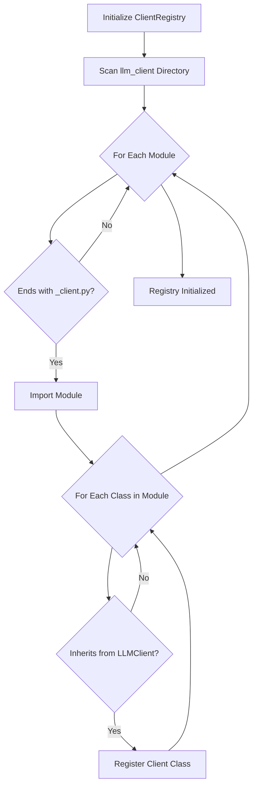

# Client Registry and Auto-Discovery

The Multi-Model LLM Architecture includes an auto-discovery mechanism that automatically finds and registers all LLM client implementations in the codebase. This eliminates the need to manually update the `TunedLLMManager` class when adding new client types.

## Auto-Discovery Process



## Client Registry Design

The ClientRegistry is designed to automatically discover and register LLM client implementations:

- It maintains a dictionary of client classes indexed by their class names
- The `initialize` method scans the `llm_client` directory for client implementations
- It provides methods to get a specific client class or all registered client classes
- The registry is initialized only once and then reused

## Client Implementation Requirements

To be automatically discovered and registered, a client implementation must:

1. Be defined in a file with a name ending in `_client.py` in the `llm_client` directory
2. Inherit from the `LLMClient` base class
3. Be defined in the module where it's imported (not imported from another module)

Example client implementation pattern:

- Create a new file named `custom_client.py` in the `llm_client` directory
- Define a class that inherits from `LLMClient`
- Implement the required methods, especially `_generate_response`
- The client will be automatically discovered and registered

## Using the Client Registry

The `TunedLLMManager` uses the client registry to create client instances:

1. It gets the client class from the registry using the client type name
2. It creates an instance of the client class with the appropriate configuration
3. The configuration includes connection parameters and client-specific settings
4. If the client type is not found in the registry, it raises an error

## Benefits of Auto-Discovery

1. **Extensibility**: New client types can be added without modifying the `TunedLLMManager` class.

2. **Maintainability**: The code is more maintainable as it follows the Open/Closed Principle (open for extension, closed for modification).

3. **Consistency**: All client types are handled in a consistent way.

4. **Discoverability**: It's easy to see what client types are available by looking at the files in the `llm_client` directory.

5. **Modularity**: Each client implementation is self-contained and doesn't need to know about the manager.

6. **Testability**: Client implementations can be tested in isolation.

7. **Flexibility**: New client types can be added by simply adding a new file following the naming convention.

## Optional Enhancement: Self-Registering Clients

For even more flexibility, clients can be made self-registering using a decorator pattern:

1. The registry provides a decorator function that registers a class when applied
2. Client implementations can use this decorator to register themselves
3. This allows clients to be registered even if they don't follow the naming convention
4. It also makes the registration more explicit and self-documenting

```python
# Example of using the decorator to register a client
from .registry import register_client

@register_client
class CustomClient(LLMClient):
    # Client implementation
    def __init__(self, config):
        super().__init__(config)
        # Custom initialization

    async def _generate_response(self, messages, response_model=None, max_tokens=None):
        # Custom implementation
        return {"content": "Response from custom client"}
```
