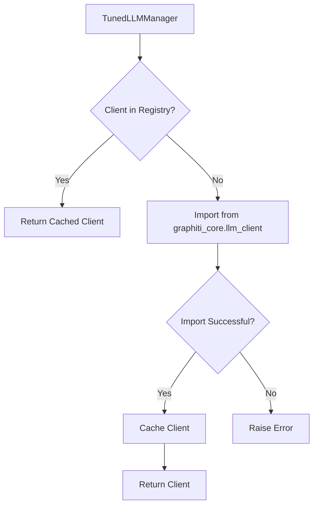

# Client Registry and Direct Imports

The Multi-Model LLM Architecture includes a client registry that manages LLM client implementations. This eliminates the need to manually update the `TunedLLMManager` class when adding new client types.

## Client Registry Design

The ClientRegistry provides a central registry for LLM client implementations:

- It imports client classes directly from `graphiti_core.llm_client` when needed
- It caches imported client classes for reuse
- It provides methods to get a specific client class or all registered client classes



## Client Implementation Requirements

To be used with the ClientRegistry, a client implementation must:

1. Be defined in the `llm_client` directory
2. Inherit from the `LLMClient` base class
3. Be exported by the `graphiti_core.llm_client` module

Example client implementation pattern:

- Create a new client class in the `llm_client` directory
- Define a class that inherits from `LLMClient`
- Implement the required methods, especially `_generate_response`
- Add the client class to the exports in `llm_client/__init__.py`

## Using the Client Registry

The `TunedLLMManager` uses the client registry to create client instances:

1. It gets the client class from the registry using the client type name
2. The registry imports the client class directly from `graphiti_core.llm_client` if needed
3. It creates an instance of the client class with the appropriate configuration
4. If the client type is not found, it raises an error

## Benefits of Direct Imports

1. **Simplicity**: Direct imports are simpler and more reliable than dynamic discovery.

2. **Maintainability**: The code is more maintainable as it follows standard Python import patterns.

3. **Consistency**: All client types are handled in a consistent way.

4. **Discoverability**: It's easy to see what client types are available by looking at the exports in `llm_client/__init__.py`.

5. **Modularity**: Each client implementation is self-contained and doesn't need to know about the manager.

6. **Testability**: Client implementations can be tested in isolation.

7. **Flexibility**: New client types can be added by simply adding them to the exports in `llm_client/__init__.py`.

## Self-Registering Clients

For additional flexibility, clients can be made self-registering using a decorator pattern:

1. The registry provides a decorator function that registers a class when applied
2. Client implementations can use this decorator to register themselves
3. This allows clients to be registered even if they're not imported in `__init__.py`
4. It also makes the registration more explicit and self-documenting

```python
# Example of using the decorator to register a client
from .registry import register_client

@register_client
class CustomClient(LLMClient):
    # Client implementation
    def __init__(self, config):
        super().__init__(config)
        # Custom initialization

    async def _generate_response(self, messages, response_model=None, max_tokens=None):
        # Custom implementation
        return {"content": "Response from custom client"}
```
