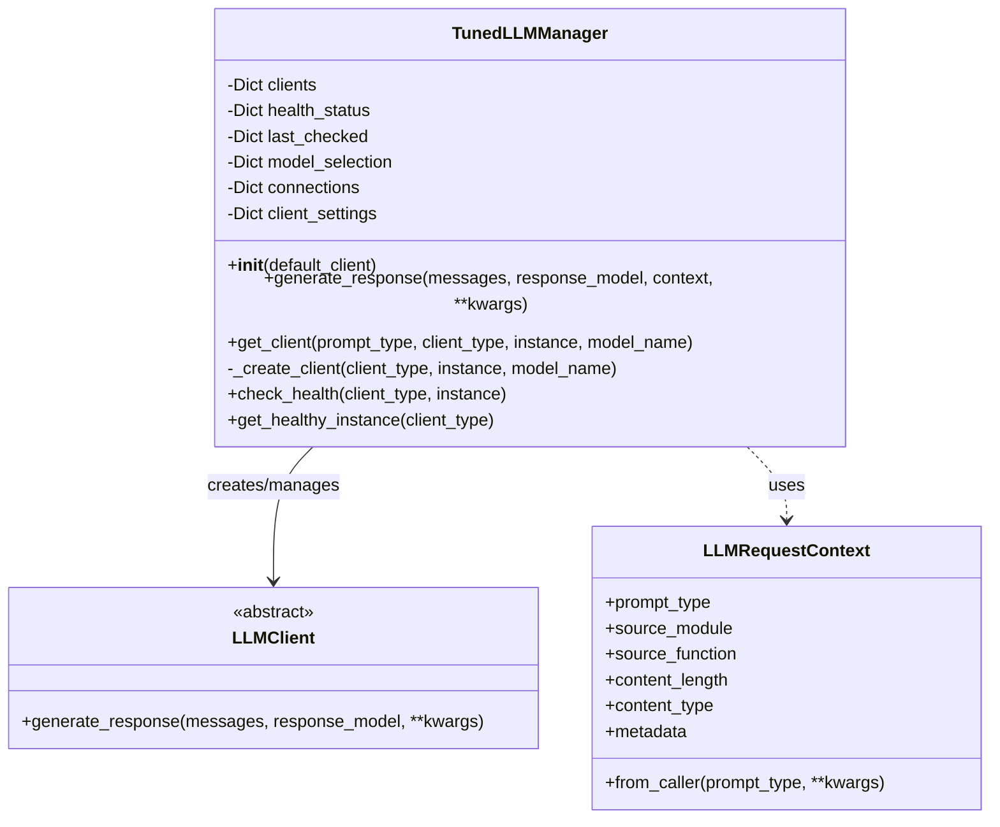

# TunedLLMManager

The `TunedLLMManager` is the central component of the Multi-Model LLM Architecture. It manages client selection, health checking, and parameter tuning based on the request context.

## Class Structure



## Key Functionality

The TunedLLMManager provides the following key functionality:

1. **Client Selection**: Selects the appropriate client, instance, and model based on the prompt type and configuration

2. **Health Checking**: Monitors the health of instances and automatically switches to healthy alternatives when needed

3. **Parameter Tuning**: Loads and applies tuning parameters based on the prompt type, client, model, and content

4. **Fallback Handling**: Gracefully handles failures by falling back to alternative clients or models

5. **Group-Specific Configuration**: Supports different configurations for different groups or databases

6. **Caching**: Reuses client instances to avoid creating new connections for each request

## Request Context

The `LLMRequestContext` class captures information about the request context:

1. **Prompt Type**: The type of prompt being used (e.g., NODE_EXTRACTION, EDGE_EXTRACTION)

2. **Source Information**: The module and function that initiated the request

3. **Content Information**: Details about the content being processed (length, type)

4. **Metadata**: Additional information that might be useful for tuning or tracking

The context can be created manually or automatically from the calling function using the `from_caller` method.

## Integration with Graphiti

The `TunedLLMManager` is integrated with Graphiti as a drop-in replacement for any LLMClient:

1. It can be used with existing extraction functions without modification
2. It automatically handles client selection, health checking, and parameter tuning
3. It receives the group_id from Graphiti operations at runtime
4. It maintains consistency across operations by using the same group_id for all related requests

## Usage Example

Here's how the `TunedLLMManager` is used in an extraction function with Graphiti:

```python
# Example usage in an extraction function called by Graphiti
async def extract_nodes(llm_client, episode, **kwargs):
    # The group_id is passed from Graphiti operations to the extraction function
    group_id = kwargs.get('group_id')

    # Create a request context with the prompt type
    context = LLMRequestContext.from_caller(
        prompt_type=PromptType.NODE_EXTRACTION,
        content_length=len(episode.content),
        content_type=str(episode.source)
    )

    # Prepare the messages for the LLM
    messages = [
        {"role": "system", "content": "Extract key entities from the text."},
        {"role": "user", "content": episode.content}
    ]

    # Generate a response with the context and group_id
    # The TunedLLMManager will automatically:
    # 1. Select the appropriate client, instance, and model for this group
    # 2. Apply tuning parameters based on the prompt type
    # 3. Handle any health or availability issues
    response = await llm_client.generate_response(
        messages,
        response_model=ExtractedNodes,
        context=context,
        group_id=group_id  # Pass the group_id from Graphiti
    )

    return response.get('extracted_nodes', [])
```

This ensures that the same group-specific configuration is used consistently across all operations for a given group.
