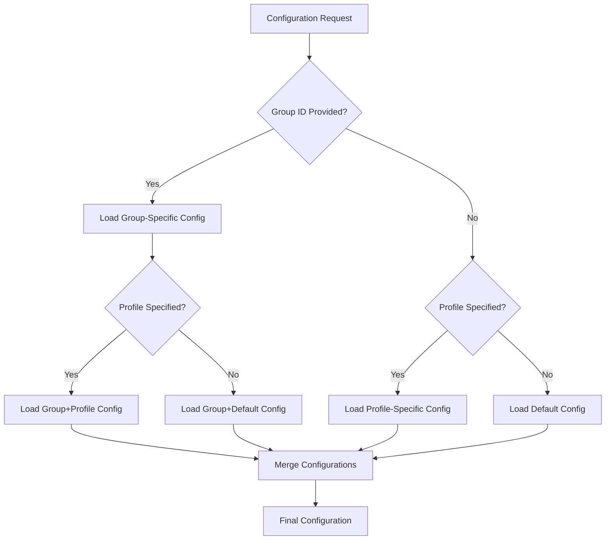

# Group-Specific Configurations

The Multi-Model LLM Architecture supports group-specific configurations, allowing you to use different settings for different groups or databases. This is particularly useful in multi-tenant environments or when different projects have different requirements.

## Configuration Hierarchy



## Directory Structure

The configuration system uses a hierarchical directory structure to organize configurations:

```
configs/
├── default/                  # Default configuration
│   └── llm/
│       ├── default.yaml
│       ├── clients/
│       └── models/
├── production/               # Environment-specific configuration
│   └── llm/
│       ├── default.yaml
│       ├── clients/
│       └── models/
├── development/              # Another environment-specific configuration
│   └── llm/
│       ├── default.yaml
│       ├── clients/
│       └── models/
└── groups/                   # Group-specific configurations
    ├── group_123/            # Configuration for group 123
    │   └── llm/
    │       ├── default.yaml
    │       ├── clients/
    │       └── models/
    └── group_456/            # Configuration for group 456
        └── llm/
            ├── default.yaml
            ├── clients/
            └── models/
```

## Configuration Resolution

Configurations are resolved in the following order of precedence:

1. Group-specific configuration (if a group ID is provided)
2. Profile-specific configuration (if a profile is specified)
3. Default configuration

This allows you to override specific settings for different groups or environments while inheriting the rest from the default configuration.

## Environment Variables

The configuration system uses environment variables to determine which configuration to use:

```
LLM_CONFIG_ROOT=/path/to/configs       # Root directory for configurations
LLM_CONFIG_PROFILE=production          # Configuration profile to use
```

These can be set in the environment or in a `.env` file.

## Using Group-Specific Configurations

### In Graphiti Runtime Operations

Graphiti is designed to allow providing the group_id at runtime when adding episodes or querying:

```python
# Add an episode with a specific group ID
await graphiti.add_episode(
    content="Episode content",
    source="user",
    group_id="123"  # This will use configs/groups/group_123/llm/default.yaml
)

# Search with a specific group ID
results = await graphiti.search(
    query="Search query",
    group_id="123"  # This will use the same group-specific configuration
)

# Build communities with a specific group ID
communities = await graphiti.build_communities(
    group_id="123"  # Consistent group-specific configuration across operations
)
```

### In Direct LLM Client Calls

```python
# Generate a response with a specific group ID
response = await llm_client.generate_response(
    messages,
    response_model=ExtractedNodes,
    context=request_context,
    group_id="123"  # Override the default group ID
)
```

## Example Group-Specific Configuration

```yaml
# configs/groups/group_123/llm/default.yaml

# Group-specific connection settings
connections:
  OllamaClient:
    instances:
      local:
        base_url: "http://192.168.1.123:11434"  # Group-specific Ollama instance

  OpenAIClient:
    api_key: "${GROUP_123_OPENAI_API_KEY}"  # Group-specific API key

# Group-specific model selection
model_selection:
  node_extraction:
    client: "OllamaClient"
    model: "llama3.3:70b-instruct-q8_0"  # Use a more powerful model for this group
```

## Benefits of Group-Specific Configurations

1. **Multi-Tenant Support**: Different tenants or groups can have different configurations.

2. **Resource Isolation**: Each group can use different servers or instances.

3. **Security Isolation**: Each group can have its own API keys and credentials.

4. **Performance Tuning**: Different groups can use different models or parameters based on their needs.

5. **Cost Management**: High-priority groups can use more expensive models, while low-priority groups can use cheaper ones.

6. **Flexibility**: Configurations can be changed for specific groups without affecting others.

7. **Experimentation**: New features or models can be tested with specific groups before rolling out to everyone.
