# Prompt Library Mapping

This document maps out the hierarchy of the prompt library and the functions that call each prompt. This serves as a reference for implementing the configuration system.

## Prompt Library Hierarchy

```mermaid
graph TD
    A[prompt_library] --> B[extract_nodes]
    A --> C[extract_edges]
    A --> D[dedupe_nodes]
    A --> E[dedupe_edges]
    A --> F[invalidate_edges]
    A --> G[extract_edge_dates]
    A --> H[summarize_nodes]
    A --> I[eval]
    
    B --> B1[extract_message]
    B --> B2[extract_json]
    B --> B3[extract_text]
    B --> B4[reflexion]
    B --> B5[classify_nodes]
    
    C --> C1[edge]
    C --> C2[reflexion]
    
    D --> D1[node]
    D --> D2[node_list]
    
    E --> E1[edge]
    E --> E2[edge_list]
    
    F --> F1[v2]
    
    G --> G1[v1]
    
    H --> H1[summarize_pair]
    H --> H2[summarize_context]
    H --> H3[summary_description]
    
    I --> I1[qa_prompt]
    I --> I2[eval_prompt]
    I --> I3[query_expansion]
```



## Prompt Library Usage

This table maps each prompt library function to the utility function that calls it:

| Prompt Library Path | Called By Function | File |
|---------------------|-------------------|------|
| `extract_nodes.extract_message` | `extract_message_nodes` | `node_operations.py` |
| `extract_nodes.extract_text` | `extract_text_nodes` | `node_operations.py` |
| `extract_nodes.extract_json` | `extract_json_nodes` | `node_operations.py` |
| `extract_nodes.reflexion` | `extract_nodes_reflexion` | `node_operations.py` |
| `extract_nodes.classify_nodes` | `classify_nodes` | `node_operations.py` |
| `dedupe_nodes.node` | `dedupe_extracted_nodes` | `node_operations.py` |
| `dedupe_nodes.node_list` | `dedupe_node_list` | `node_operations.py` |
| `extract_edges.edge` | `extract_text_edges` | `edge_operations.py` |
| `extract_edges.reflexion` | `extract_text_edges` | `edge_operations.py` |
| `dedupe_edges.edge` | `dedupe_extracted_edges` | `edge_operations.py` |
| `dedupe_edges.edge_list` | `dedupe_edge_list` | `edge_operations.py` |
| `invalidate_edges.v2` | `get_edge_contradictions` | `temporal_operations.py` |
| `extract_edge_dates.v1` | `extract_edge_dates` | `temporal_operations.py` |
| `summarize_nodes.summarize_pair` | `summarize_pair` | `community_operations.py` |
| `summarize_nodes.summarize_context` | `dedupe_extracted_node` | `node_operations.py` |
| `summarize_nodes.summary_description` | `generate_summary_description` | `community_operations.py` |

## Configuration Structure

For the configuration system, we'll use the exact prompt library paths as configuration keys. This provides a direct correspondence between the prompt library and the configuration, making it clear which configuration applies to which prompt.

Example configuration structure:

```yaml
# Common parameters for all prompts
common:
  temperature: 0.7
  top_p: 0.95
  frequency_penalty: 0.0
  presence_penalty: 0.0
  max_tokens: 8192

# Top-level prompt categories
extract_nodes:
  temperature: 0.2
  max_tokens: 4096
  
  # Sub-categories
  extract_message:
    max_tokens: 6144
  
  extract_text:
    max_tokens: 4096
    
  extract_json:
    max_tokens: 4096
    
  reflexion:
    temperature: 0.0
    max_tokens: 2048
    
  classify_nodes:
    temperature: 0.1
    max_tokens: 2048

extract_edges:
  temperature: 0.1
  max_tokens: 8192
  
  edge:
    max_tokens: 8192
    
  reflexion:
    temperature: 0.0
    max_tokens: 2048

# And so on for other prompt types...
```

When determining which configuration to use, the TunedLLMManager will:

1. Identify the prompt library path being used (e.g., `extract_nodes.extract_message`)
2. Look for a configuration at that exact path
3. If not found, fall back to the parent path (e.g., `extract_nodes`)
4. If still not found, fall back to the common configuration

This approach provides a clean, intuitive mapping between the prompt library and the configuration system.
