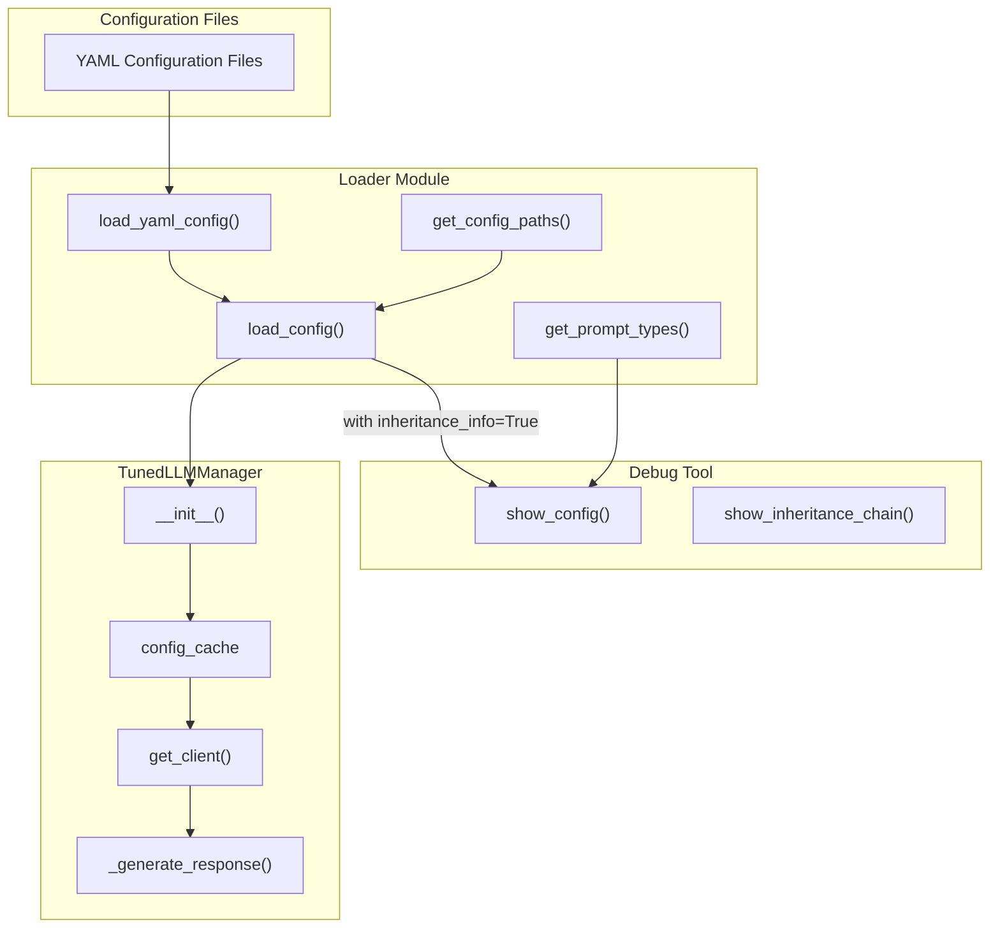
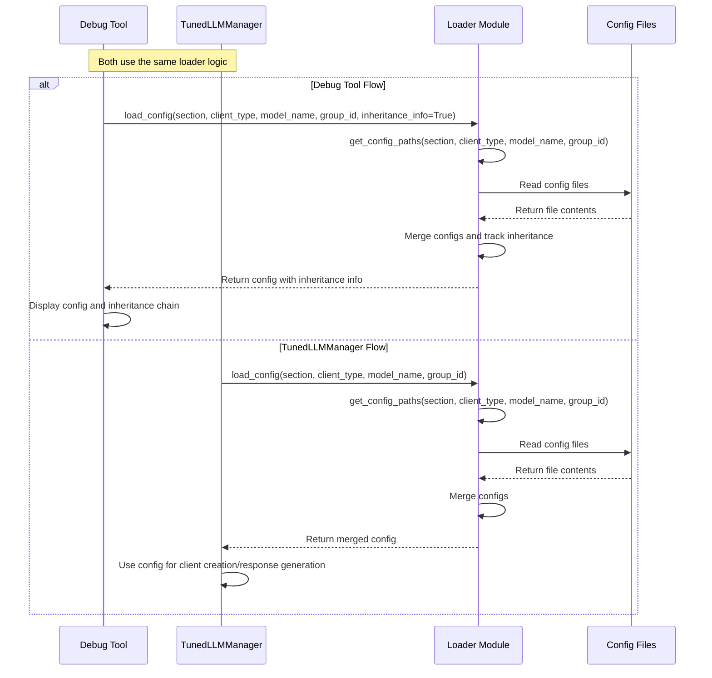

# TunedLLM Configuration Flow

This diagram illustrates the flow of configuration loading and resolution in the TunedLLM architecture.

## Key Components

### Loader Module

1. **get_config_paths(section, client_type, model_name, group_id)**
   - Returns a list of configuration file paths in order of precedence
   - Used by both the TunedLLMManager and the debug tool

2. **load_yaml_config(config_path)**
   - Loads a YAML configuration file
   - Resolves environment variables
   - Returns the parsed configuration

3. **load_config(section, client_type, model_name, group_id, inheritance_info=False)**
   - Loads and merges configurations from multiple files
   - When `inheritance_info=True`, returns additional information about which values came from which files
   - Used by both the TunedLLMManager and the debug tool

4. **get_prompt_types(group_id=None)**
   - Returns a list of all available prompt types
   - Looks in both model_selection and default.yaml
   - Used primarily by the debug tool

### TunedLLMManager

1. **__init__(config, cache, group_id)**
   - Initializes the manager with the specified group_id
   - Loads the model selection configuration
   - Sets up client tracking and health checking
   - Initializes the configuration cache

2. **config_cache**
   - Stores configurations for different prompt types
   - Populated during initialization or on-demand
   - Avoids repeated loading of the same configuration

3. **get_client(prompt_type, client_type, instance, model_name, group_id)**
   - Determines which client, instance, and model to use based on cached configuration
   - Creates or retrieves the appropriate client
   - Handles health checking and fallbacks

4. **_generate_response(messages, response_model, max_tokens, **kwargs)**
   - Gets the appropriate client for the prompt type
   - Gets the configuration from the cache
   - Applies content-based adjustments
   - Calls the client with the tuned configuration

### Debug Tool

1. **show_config(prompt_type, group, verbose)**
   - Shows the resolved configuration for a prompt type
   - When verbose=True, shows the inheritance chain
   - Uses `load_config(inheritance_info=True)` to get detailed information

2. **show_inheritance_chain(prompt_type, config, inheritance_info)**
   - Displays which values came from which files
   - Highlights values that made it to the final configuration

## Configuration Resolution Flow

### TunedLLMManager Flow

1. During initialization, TunedLLMManager calls `load_config("model_selection", group_id=group_id)` to load the model selection configuration
2. It may also pre-load common configurations into the config_cache
3. When `get_client()` is called, it checks the config_cache first
4. If the configuration is not in the cache, it calls `load_config()` and stores the result in the cache
5. The cached configuration is used for client creation and response generation

### Debug Tool Flow

1. The debug tool calls `get_prompt_types()` to get all available prompt types
2. For each prompt type, it calls `load_config(prompt_type, client_type, model_name, group_id, inheritance_info=True)`
3. `load_config()` calls `get_config_paths()` to get the list of configuration files
4. `load_config()` loads each file using `load_yaml_config()`
5. `load_config()` merges the configurations in order of precedence
6. With `inheritance_info=True`, `load_config()` tracks which values came from which files
7. The debug tool displays the resolved configuration and inheritance information

